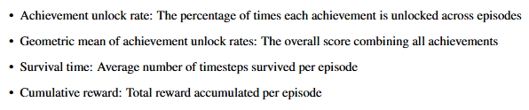

# Requirements

1. Refer to results section
2. Analyse baseline results and identify improvements that can be made
3. Hypothesise improvements that improvement 1 will make
4. Analyse results of improvement 1 to confirm hypothesis, particularly improvements to survival reward and acheivement rewards.
5. Repeat steps 1 - 4 for improvement 1 to improvement 2
6. Compare DQN to PPO, commenting on strengths and weaknesses, how well each agent achieves the goal and their rates of learning
7. In methodology, mention how the implementation is different from a standard implementation (how is this RND different from standard RND).

# Evaluation

1. Add graphs
2. Evaluate based on 
3. Discuss results